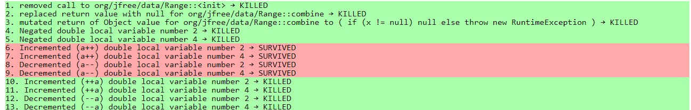
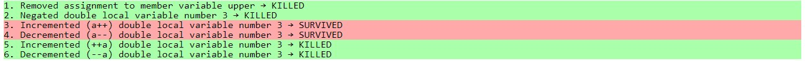

**SENG 438 - Software Testing, Reliability, and Quality**

**Lab. Report \#4 – Mutation Testing and Web app testing**

| Group \#: 15          |     |
| --------------------- | --- |
| Student Names:        |     |
| Carlos Morera Pinilla |     |
| Neil Adrian Sarmiento |     |
| Toshi Biswas          |     |
| Hassan Anwar          |     |

# Introduction

This lab extends on the more rigourous and complex world of testing, testing an actual GUI application
with many possible combinations of user interactions and inputs for the system. While also gaining experience on mutant testing
such that when we insert bugs into the program, the tests should fail and not ignore the faults.

# Analysis of 10 Mutants of the Range class

These 13 mutants belong to the combine() method, and this line tests whether or not it can build the correct
range of values.

Our current test case for this method, kills 9 mutants and leaves 4 survivors. And according to the report, the bug lies
in the fact that if the variables "l" and "u", which are the minimum and maxmimum of the new combined Ranges, are post-incremented.
So l++ and u++, then the Range is constructed BEFORE the values are properly incremented.
Likewise, if they are pre-incremented, then l and u will be incremented BEFORE the Range constructor is called.

The rest of the mutants deal with null values and throwing exceptions, and negating the l and u values so that the Range is
out of order all of which are properly killed.

# Report all the statistics and the mutation score for each test class

The mutation score is the middle bar at 58% for Range.java

# Analysis drawn on the effectiveness of each of the test classes

The test cases for the most part on pre-incrementation perform well, the mutants are caught and killed.
The struggle lies in the pre-incrementation of values, and some conditional boundaries. Because some values may still hold true
even though the condition was changed. And stubborn mutants with post-increment values, cannot be fixed.

# A discussion on the effect of equivalent mutants on mutation score accuracy

- Photo of some equivalent mutants on the Range Constructor, the ones in red in particular.
  

Because equivalent mutants perform the exact same way as the normal code. They cannot help in finding bugs in the program.
So due to this, they cannot be killed because the program thinks there is nothing wrong with the code, thus the test case passes.

From the source code, most equivalent mutants come from post-incrementing the value while it is used in (). Such as a function call or if statement because the statement is evaulated using the CURRENT values first, and once its done it will then do the incrementation.

# A discussion of what could have been done to improve the mutation score of the test suites

Most of the surviving mutants are due to equivalent mutants of the post-incrementation of values in the function call.
There isn't much to fix.

# Why do we need mutation testing? Advantages and disadvantages of mutation testing

Because coverage metrics only determine if the functions enter the branches based on conditions and checks only whether the lines
of code are executed regardless of logical correctness.
But it does not check if the code is logically correct.
It does not check that your tests are actually able to detect faults in the executed code.
It is therefore only able to identify code that is definitely not tested.

# Explain your SELENUIM test case design process

WEBSITE: COSTCO CANADA

Test Login process
Test Searching for an Item that exists
Test Searching for an Item that does not exist.
Test Add to Cart  
Test transaction process (but not purchasing the item)
Test navbar
Test change language.
Test Change Region

# Explain the use of assertions and checkpoints

Checkpoints in Selenium are automatically recorded for use.
So we know where the GUI testing failed if Selenium was not able to record the input
and attempt to emulate it.

# how did you test each functionaity with different test data

On the travel website we attempted to put in different fields for invalid trips lasting
over 30 days and valid trips as well as trying to book a valid trip.

As well as on the login page with valid and invalid credentials to make sure access to the account
was either valid or invalid.

Added to Cart was testing with different items.

Search Items was tested with different items that exist or do not exist in stock.

# Discuss advantages and disadvantages of Selenium vs. Sikulix

Selenium web driver only automates website applications, whereas Sikulix can support other types of applications
such as a window application.

Sikulix is much more archaic and diffucult to use because you have to take screenshots of portions of an icon you want to test.
And then it asks you set the click pixel by pixel.
In terms of user-friendliness Selenium is better, but in terms of testing more applications other than web applications, Sikulix is better.

# How the team work/effort was divided and managed

- Carlos and Hassan handled the mutation testing.
- Neil and Carlos and Toshi handled the GUI testing part.

# Difficulties encountered, challenges overcome, and lessons learned

Understanding how the mutation worked, especially the lingo, knowing how to find equivalent mutants and making sure
what could be fixed as well as the long time it takes to set up a mutatation test.

# Comments/feedback on the lab itself

This was a very frustrating and annoying lab to complete, the technology is unstable, the mutation lingo does not make any sense
and Selenium does not work half the time because some simple methods such as resizing the window would fail unless we had the
testing window open already.
